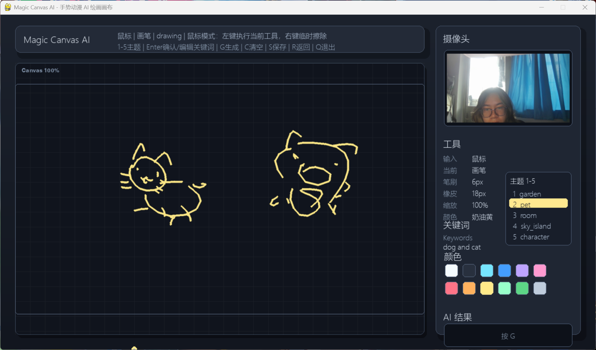
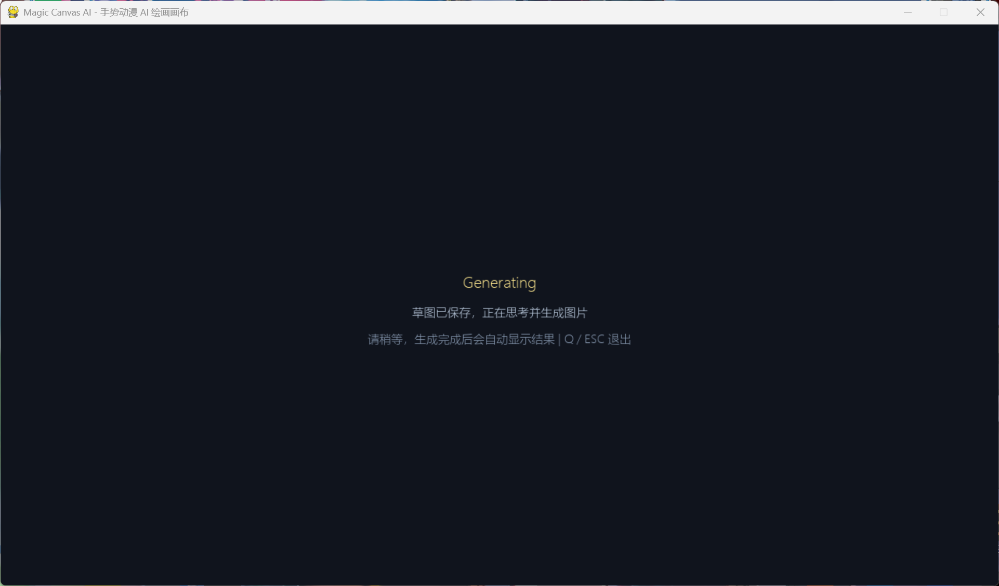
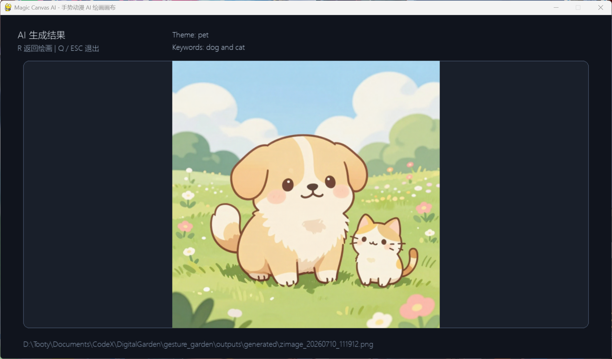
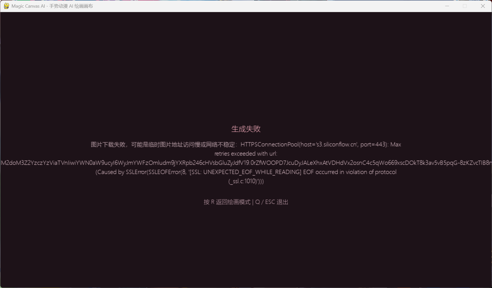

# Magic Canvas AI

一个基于 Python、Pygame、OpenCV、MediaPipe 和 SiliconFlow 的手势动漫 AI 绘画原型项目。

用户可以用摄像头手势或鼠标在画布上绘制草图，选择主题并输入关键词后，按 `G` 自动保存草图、生成 Prompt、调用 SiliconFlow 图片生成接口，并在窗口中展示生成结果。

## 项目效果

### 绘画界面



### 生成中



### 生成结果



### 错误提示



## 主要功能

- 摄像头手势绘画。
- 鼠标备用绘画模式。
- 画笔颜色、画笔粗细、橡皮和缩放。
- 主题切换：`garden`、`pet`、`room`、`sky_island`、`character`。
- 关键词输入，例如 `dog and cat`、`flowers tree small house`。
- 按 `G` 自动保存草图、生成 Prompt、调用 SiliconFlow、展示结果。
- 生成失败时显示错误提示，按 `R` 返回绘画。

## 快速开始

```powershell
cd D:\Tooty\Documents\CodeX\DigitalGarden\gesture_garden
.\.venv\Scripts\python.exe -m pip install -r requirements.txt
.\.venv\Scripts\python.exe main.py
```

如果还没有虚拟环境：

```powershell
cd D:\Tooty\Documents\CodeX\DigitalGarden\gesture_garden
py -3.12 -m venv .venv
.\.venv\Scripts\python.exe -m pip install -r requirements.txt
.\.venv\Scripts\python.exe main.py
```

## API 配置

在 `gesture_garden/.env` 中配置：

```env
SILICONFLOW_API_KEY=你的_API_Key
SILICONFLOW_BASE_URL=https://api.siliconflow.cn/v1
SILICONFLOW_IMAGE_MODEL=Tongyi-MAI/Z-Image-Turbo
```

`.env` 是本地密钥文件，不应该提交到 GitHub。

## 常用按键

| 按键 | 功能 |
| --- | --- |
| `G` | 保存草图并生成 AI 图片 |
| `R` | 从结果页或错误页返回绘画 |
| `C` | 清空画布 |
| `S` | 保存当前草图 |
| `M` | 切换手势 / 鼠标模式 |
| `1` - `5` | 切换生成主题 |
| `Enter` | 确认 / 编辑关键词 |
| `Backspace` | 删除关键词 |
| `TAB` | 切换画笔颜色 |
| `[` / `-` | 减小画笔粗细 |
| `]` / `=` | 增大画笔粗细 |
| `Q` / `ESC` | 退出程序 |

## 输出目录

草图保存到：

```text
gesture_garden/data/sketches/
```

AI 生成图片保存到：

```text
gesture_garden/outputs/generated/
```

## 更多说明

详细说明见：

```text
gesture_garden/README.md
```
